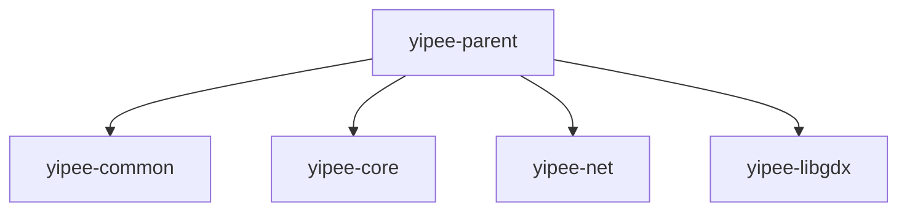

[](https://github.com/blakbro2k/Yipee/actions/workflows/maven-publish.yml)  
# Yipee! Towers  
**_A modern, from-scratch recreation of Yahoo! Towers — multiplayer puzzle action, rebuilt for today’s platforms._**

## Welcome

**Yahoo! Towers** was an online multiplayer puzzle game hosted on Yahoo! Games in the late 1990s and early 2000s. Players competed in real-time by clearing falling blocks, sending attacks to opponents, and coordinating with a partner to outlast the opposing team. Known for its fast-paced gameplay and cooperative twist, it built a devoted competitive community before Yahoo! Games shut down in 2016.

---

## About this Project

**Yipee! Towers** is a modern recreation of the classic **Yahoo! Towers** multiplayer puzzle game.

Yipee is a labor of love — built from scratch without access to the original code. This project has navigated the many pitfalls of multiplayer game design, from the quirks of real-time netcode to the challenges of re-creating gameplay purely from observation and memory.

The result is both a tribute to the original and a modern engineering exercise in cross-platform multiplayer systems.

This repository (`yipee-parent`) is the Maven parent project that organizes and builds all Yipee modules, including shared logic, core game mechanics, networking code, and platform-specific clients.

---

## Purpose of the Project

The goal of Yipee is to faithfully recreate Yahoo! Towers while modernizing it for today’s platforms.

The recreation focuses on:
- Preserving the original gameplay feel and mechanics.
- Supporting multiplayer matches with synchronized states between all players.
- Designing a modular architecture to allow clients on multiple platforms.
- Enabling cross-platform play via consistent core logic and networking protocols.

---

## Project Structure

### Module Overview



---

### **yipee-common**
Contains all **shared definitions** used by any platform or server.  
Ensures data models, enums, and serialization logic are consistent across implementations.

Contents:
- **Data models** shared across server and client.
- **Enums, constants, and utility classes**.
- **Interfaces** for game state, actions, and serialization.

---

### **yipee-core**
The **platform-agnostic core game logic**.  
Holds all rules, mechanics, and authoritative state updates.

Contents:
- **Game loop & mechanics** — piece movement, attacks, scoring.
- **Game objects** — boards, tables, players.
- **Persistence API** — database interfaces for saving/loading.

---

### **yipee-net**
Handles all **network transport and communication** logic.

Contents:
- **Transport utilities** (KryoNet, etc.).
- **Client-server communication handling**.
- **Protocol definitions**.
- **Net registrar** — network packet registration.
- **Net package** — packet definitions for server-client sync.

---

### **yipee-libgdx**
The **Java/LibGDX platform-specific representation** of `yipee-core`.  
This adapts core logic into LibGDX-compatible types (e.g., `YipeeGameBoard` → `YipeeGameBoardGDX`) so the client can render the game and handle input while maintaining full compatibility with the server.
The idea is since Webservices will be used to transport packets, a native package based off of core can be used to translate JSON to the native objects

Contents:
- **Rendering & UI** (LibGDX Scene2D, textures, animations).
- **Platform-native input handling**.
- **Asset management** (sprites, sounds, effects).
- **Client-side prediction & rollback** for smooth gameplay.
- **Bridges to core logic** for state updates and networking.

---

### **Future Considerations**
Yipee’s architecture is designed for easy expansion.  
Any future platform-specific layer (e.g., Python, .NET, web) can complement `yipee-libgdx`, utilizing:
- **yipee-common** (shared models)
- **yipee-core** (game rules)
- **yipee-net** (protocols & transport)

---

## Getting Started

1. **Clone the repository**
   ```bash
   git clone https://github.com/YOUR_USERNAME/yipee-parent.git
   ```
2. **Build with Maven**
   ```bash
   mvn clean install
   ```
3. **Run the core game** (YipeeTestDriver is a CLI version of running the minimal game).
   **It is incomplete at the moment**

---

## Contributing

We welcome contributions!

Ways you can help:
- **Code:** Bug fixes, new features, or optimizations.
- **Testing:** Playtest builds and report bugs.
- **Assets:** Sprites, sounds, and UI elements matching the game’s style.
- **Documentation:** Improve tutorials and developer guides.

**How to contribute:**
1. Fork the repo.
2. Create a new branch:
   ```bash
   git checkout -b feature/my-feature
   ```
3. Commit your changes and push.
4. Submit a Pull Request describing your changes and their purpose.

---

## License

Licensed under the Apache License, Version 2.0.  
See the [LICENSE](LICENSE) file for details.
